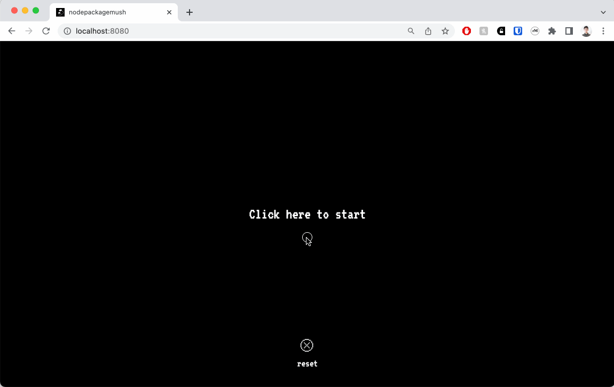

# nodepackagemush

## ABOUT



a lil mushroom! click to initialize, your mushroom will continue to grow even while you're away. reset to restart.

Features:

- Persistent growth: thanks to the magic of localStorage and React Effects, your pet mushroom will (seemingly) keep growing even if your app isn’t running
- Seeding from user location: using JavaScript’s Geolocation API and backend APIs, the app will query the database using your geographic coordinates and choose a mushroom that grows in your region
- Animations: opening animations and your mushroom’s bounce powered by Anime.js, CSS styling, and conditional React rendering

The application uses the following technologies and frameworks:
Javascript, React.js, Redux, HTML/CSS, CSS Modules, Node.js, Express.js, PostgreSQL, Sequelize, Anime.js, Geolocation API, Render

## SETUP

To run this application on your local device, follow these setup instructions:

- Ensure that your local machine has Node.js and PostgreSQL installed.
- NODE.JS : the Node.js package can be downloaded using Homebrew with `brew install node`. Further instructions for different operating systems and methods can be found at (https://nodejs.dev/en/download/package-manager/).
- POSTGRESQL : on macOS, the PostgreSQL package can be installed using Homebrew with `brew install postgresql@14`. Further instructions can be found at (https://www.postgresql.org/download/)

- Clone this repo onto an empty directory on your local machine with `git clone git@github.com:lateral-neck-stretch/nodepackagemush.git`

- Once the repo has been cloned, install the necessary dependencies with `npm install`

- Create two PostgreSQL databases (one for test and one for development) with:

```
createdb nodepackagemush
createdb nodepackagemush-test
```

## START

### Building the database

- Sync and seed your database by running `npm run seed`.

### Running and using the application

- Run `npm run start:dev` start the server and build client-side files with webpack.
- Click on 'Click here to start' on the webpage to initialize your mushroom. Your browser might prompt you to allow the app to use your location. The app will only use this data to select a mushroom type for you, but it will still work if you'd prefer to keep that information private.
